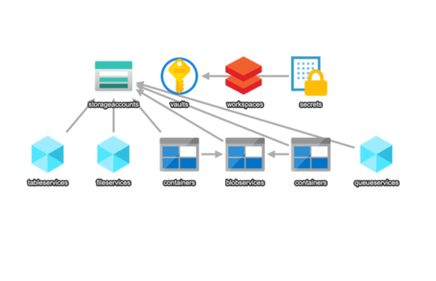

# TechCarbonELT: Azure Pipeline for CDP Emissions Data

## Project Overview

TechCarbonELT is an Azure-based ELT (Extract, Load, Transform) pipeline project designed to analyze carbon emissions data from a major technology company. This project utilizes CDP (Carbon Disclosure Project) data to examine the carbon footprint of a leading tech giant and provide meaningful insights.

## Table of Contents

1. [Project Objectives](#project-objectives)
2. [Technologies Used](#technologies-used)
3. [Data Source](#data-source)
4. [Architecture](#architecture)
5. [Setup](#setup)
6. [Usage](#usage)
7. [Analysis and Results](#analysis-and-results)
8. [License](#license)

## Project Objectives

- Extract and process CDP emissions data for a leading technology company
- Analyze Scope 1, Scope 2, and Scope 3 emissions
- Identify trends in carbon emissions over time
- Evaluate emission reduction efforts
- Provide insights to support sustainable practices in the tech industry

## Technologies Used

- Azure Data Factory
- Azure Data Lake Storage Gen2
- Azure Databricks
- Python (PySpark)

## Data Source

This project utilizes data from the Net-Zero Data Public Utility (NZDPU), a platform designed to support efforts in combating climate change and achieving net-zero emissions targets.

Key details about our data source:

- Source: Net-Zero Data Public Utility (NZDPU)
- Company: Anonymous
- Reporting Year: 2021
- Data Type: CDP Climate Change Questionnaire 2022

The NZDPU provides access to standardized climate-related data, including greenhouse gas emissions reported by companies through platforms like the Carbon Disclosure Project (CDP). For this project, we specifically focused on a major technology company's emissions data, which includes:

1. Scope 1 (Direct) Emissions
2. Scope 2 (Indirect) Emissions - both location-based and market-based
3. Scope 3 (Value Chain) Emissions
4. Emissions reduction initiatives and targets
5. Methodologies used for calculations

The NZDPU aims to increase data transparency, enable more accurate reporting on carbon emissions and sustainability efforts, and track progress towards net-zero targets. By using this platform, we ensure that our analysis is based on standardized, publicly available data.

For more information about the Net-Zero Data Public Utility and to access their data platform, visit [https://nzdpu.com/home](https://nzdpu.com/home).

Please note that while this data is publicly available through NZDPU, users of this project should adhere to NZDPU's terms of use and respect the rights of the reporting companies regarding this information.

The data used in this project is sourced from the Carbon Disclosure Project (CDP) and is used in compliance with the terms of the CDP Data License Agreement.

## Architecture

1. **Data Extraction**: Azure Data Factory pipelines extract data from CDP sources.
2. **Data Storage**: Raw data is stored in Azure Data Lake Storage Gen2.
3. **Data Processing and Analysis**: Azure Databricks is used for data transformation, analysis, and visualization.
4. **Data Loading**: Processed data is loaded back into a structured format in Data Lake.

## Setup

1. Azure Resources Setup:
   - Create an Azure Data Factory instance
   - Set up Azure Data Lake Storage Gen2
   - Provision an Azure Databricks workspace

2. Data Factory Pipeline Configuration:
   - Configure linked services for data sources and sinks
   - Create datasets for input and output data
   - Develop pipelines for data extraction and loading

3. Databricks Environment:
   - Create a Databricks cluster
   - Upload necessary Python scripts and notebooks

## Usage

1. Run the Data Factory pipeline to extract latest CDP data
2. Execute Databricks notebooks for data processing, analysis, and visualization
3. View results and insights in Databricks notebooks

## Analysis and Results

Our analysis of the CDP emissions data for the leading tech company reveals several important insights:

1. **Overall Emissions Profile**:
   - Total emissions: 23,186,400 tCO2e
   - Scope 1: 0.24% (55,200 tCO2e)
   - Scope 2 (Market-based): 0.01% (2,780 tCO2e)
   - Scope 3: 99.75% (23,128,420 tCO2e)

   Key Finding: The vast majority (99.75%) of the company's emissions come from Scope 3 sources, indicating that the supply chain and product use are the most significant contributors to the company's carbon footprint.

2. **Scope Comparison**:
   1. Scope 3: 23,128,420 tCO2e
   2. Scope 1: 55,200 tCO2e
   3. Scope 2 (Market-based): 2,780 tCO2e

   Notable Observation: The enormous difference between Scope 3 and other scopes underscores the importance of addressing value chain emissions for meaningful carbon reduction.

3. **Scope 2 Emissions Analysis**:
   - Location-based emissions: 1,003,246 tCO2e
   - Market-based emissions: 2,780 tCO2e
   - Difference: 1,000,466 tCO2e
   - Reduction percentage: 99.72%

   Significant Achievement: The company has achieved a 99.72% reduction in Scope 2 emissions through market-based instruments, likely indicating substantial investment in renewable energy.

4. **Emission Reduction Potential**:
   - Scope 1 reduction target (5%): 2,760 tCO2e
   - Scope 2 reduction target (10%): 278 tCO2e
   - Scope 3 reduction target (15%): 3,469,263 tCO2e

   Strategy Implication: While percentage targets for Scope 1 and 2 are higher, the absolute reduction potential in Scope 3 is significantly larger, suggesting that efforts should be concentrated on supply chain and product use emissions.

5. **Decarbonization Path**:
   - Years to net-zero (assuming 2050 target): 29 years
   - Annual reduction needed: 799,531.03 tCO2e

   Challenge Ahead: To achieve net-zero emissions by 2050, the company needs to reduce its total emissions by nearly 800,000 tCO2e each year, which is a substantial challenge given the current emissions profile.

These results highlight the company's progress in addressing direct emissions and electricity use, but also underscore the significant challenge posed by Scope 3 emissions. Future sustainability efforts should focus heavily on supply chain management, product design for energy efficiency, and customer use phase emissions to make meaningful progress towards carbon neutrality.

The stark contrast between Scope 2 location-based and market-based emissions demonstrates the effectiveness of the company's renewable energy strategy. However, the dominance of Scope 3 emissions suggests that collaborative efforts with suppliers and customers will be crucial for future emissions reductions.

## License

This project is licensed under the MIT License - see the [LICENSE](LICENSE) file for details.
